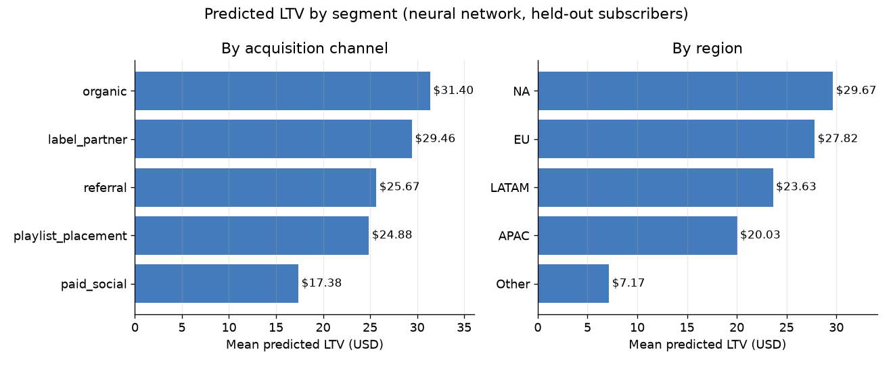
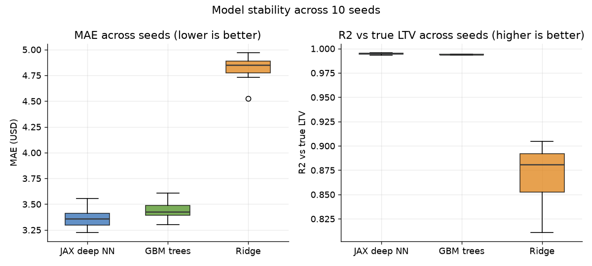
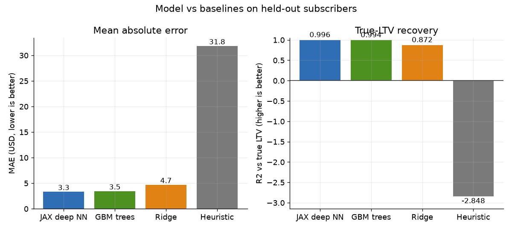
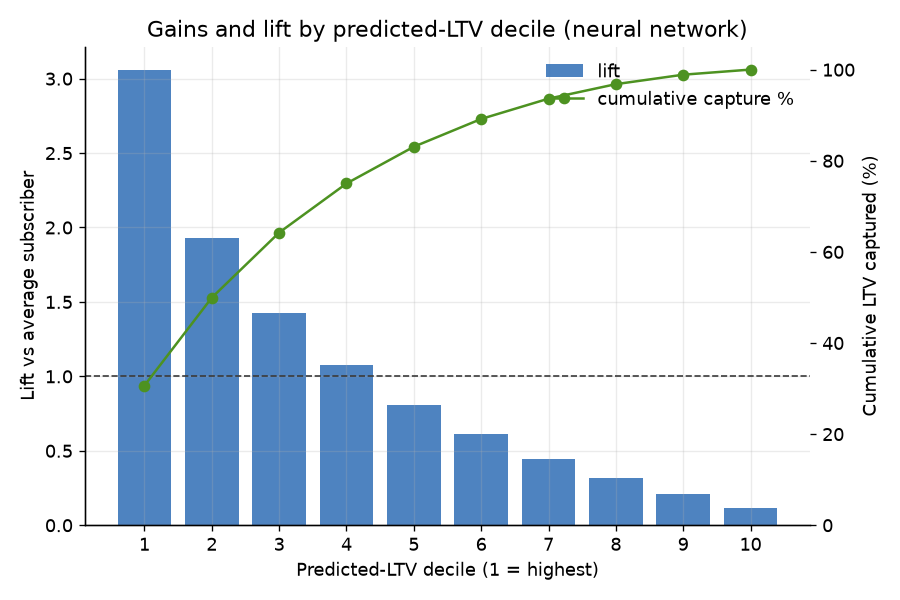
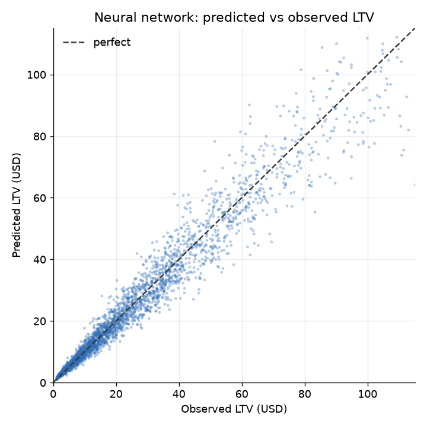
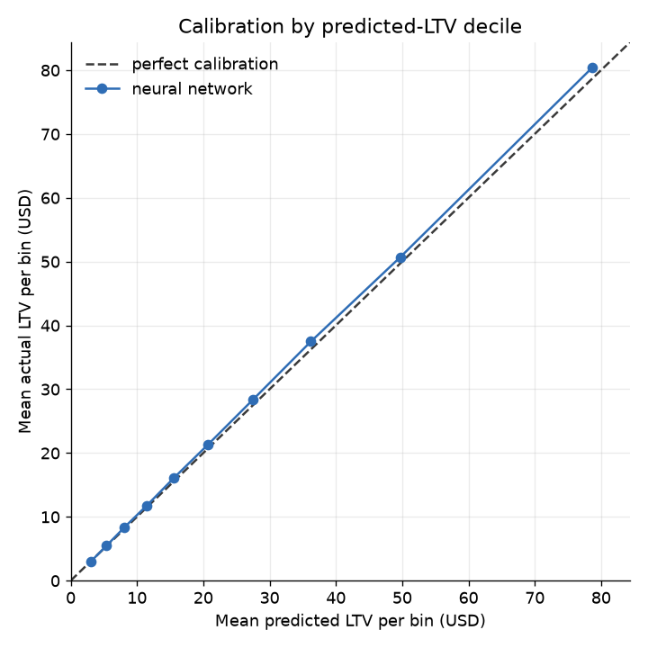
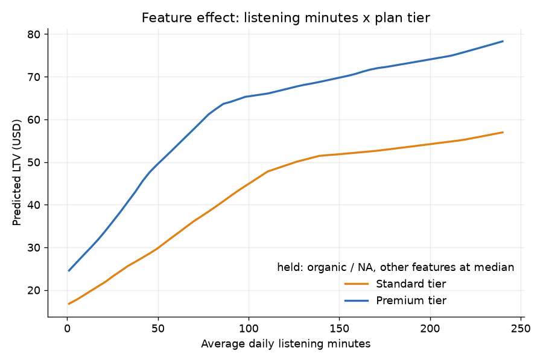
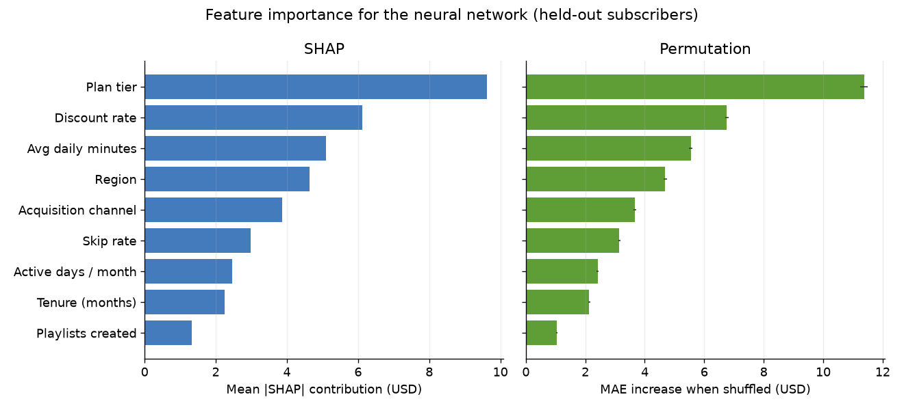
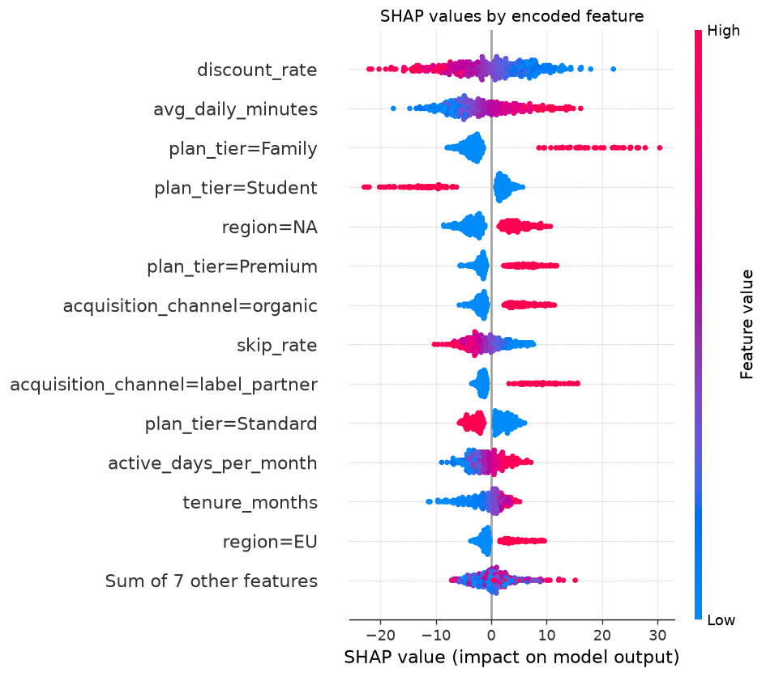

# Listener Lifetime Value (LTV) estimation with a JAX neural network

> **This is built on synthetic data.**

**Live demo:** https://k1monfared.github.io/LTV/ , the interactive in-browser LTV explorer.

Marketing and partnerships need a defensible dollar figure for what a streaming
subscriber is worth before they set acquisition budgets and negotiate label deals.
This project builds that estimate with a JAX deep neural network that predicts
24-month discounted contribution margin from nine per-subscriber features,
benchmarked against gradient-boosted trees, a linear model, and a business
heuristic. The payoff is a calibrated, per-subscriber LTV that ranks who to
acquire and retain and holds up as the basis for real spend and deal decisions.

## Outputs

LTV here is dollars of expected discounted contribution margin over a fixed 24-month horizon.



Mean predicted LTV per segment from the committed held-out scoring run, the number a growth or finance lead reads off directly. Taller bars are the channels and regions worth more to acquire and keep.

### 1. We can buy paid-social signups cheaply, but they churn fast. Is a paid-social subscriber actually worth spending to keep?

Barely, and less than any other channel. The model values the average paid-social subscriber at about $17 of 24-month LTV, against about $31 for organic and $29 for label-partner signups, roughly 45 percent less than the best channels.

How: the JAX neural network scored on held-out subscribers (`data/sample_outputs/scored_sample.csv`), giving mean predicted LTV of $17.38 for paid_social versus $31.40 organic and $29.46 label_partner. The same pattern holds in the full matured population (true 24-month LTV $15.47 paid_social versus $30.17 organic), and the model recovers that defined target at R2 0.996.

So what: keep buying paid-social only while fully loaded acquisition plus retention spend per subscriber stays under about $17. Above that the cheap signup loses money over the horizon, so the budget belongs in a steadier channel.

### 2. Two segments cost about the same to acquire. Which subscriber is worth more?

Take NA against APAC. The model predicts about $29.70 for an NA subscriber versus about $20.00 for an APAC one, so the NA subscriber is worth roughly 48 percent more.

How: same scored run, region mean predicted LTV of $29.67 for NA versus $20.03 for APAC, consistent with the full matured population (true LTV $30.09 NA versus $19.93 APAC).

So what: at equal acquisition cost, weight budget toward NA and accept a higher cost per signup there, because it still pays back. Read off any two segments the same way before setting their bids.

### 3. Limited retention budget. Where does it protect the most future value?

The top tenth of subscribers by predicted LTV averages $80.35 against an overall average near $26, a lift of 3.06x, and the top three deciles hold 64 percent of all lifetime value.

How: neural network ranking on the 4,793-subscriber held-out test (`outputs/metrics.json`, decile gains). The gradient-boosted tree baseline produces a nearly identical ranking, so the targeting call does not depend on the deep model.

So what: point retention and upsell spend at the top roughly 30 percent of subscribers to cover about two-thirds of future value, rather than spreading it evenly.

These answers come from four pieces documented below: the LTV model, a small JAX multilayer perceptron, and its defined target of expected discounted contribution margin over 24 months; the baselines it is checked against, gradient-boosted trees plus a ridge model and a margin heuristic, where the deep net and the trees land within about 2 percent of each other on MAE (3.36 versus 3.43 over 10 seeds), so the simpler model stays defensible; and the feature set of nine per-subscriber inputs. The rest of this document is that technical build.

---

## Contents

- [How to run](#how-to-run)
- [The business question](#the-business-question)
- [Approach in one picture](#approach-in-one-picture)
- [Creating the ground truth: defining the LTV target](#creating-the-ground-truth-defining-the-ltv-target)
- [Key results: deep NN vs a conventional model](#key-results-deep-nn-vs-a-conventional-model)
- [Feature importance: SHAP and permutation](#feature-importance-shap-and-permutation)
- [Interactive explorer](#interactive-explorer)
- [Inputs, outputs, and feature selection](#inputs-outputs-and-feature-selection)
- [Business impact](#business-impact)
- [Cold start](#cold-start)
- [Limitations](#limitations)
- [What a production version would add](#what-a-production-version-would-add)
- [Tech](#tech)

## How to run

Interactive demo: 
```
sh demo.sh #serves the page on a free local port and opens your browser
```

Everything is reproducible from one entry point with a fixed seed.

```bash
python -m venv .venv
source .venv/bin/activate
pip install -r requirements.txt

python scripts/run_demo.py
```

This regenerates the dataset, trains the network and baselines, runs the 10-seed
evaluation, writes metrics and the reports, exports the weights, and produces every
figure. Console output includes the single-split and aggregate model-vs-baseline
numbers above and the head-to-head win counts.

The repository already contains all committed outputs, so you can read the
results and open the explorer without running anything.

An optional read-only add-on computes feature importance (SHAP and permutation)
for the trained network, writing two figures and a summary. It changes no model
or metric.

```bash
python scripts/feature_importance.py
```

## The business question

A music distributor earns a margin on every month a listener keeps streaming.
Some listeners stay for years, some churn after a promotion ends. Knowing the
expected lifetime value of a subscriber, and of a whole cohort, changes real
decisions:

- How much is it worth to acquire a listener through a given channel?
- Which cohorts should marketing spend protect?
- What deal terms can we offer label partners, when we can defend the projected
  value of the audience we bring?

At a music distributor this LTV estimate feeds negotiations over deal conditions
with label companies. The version here reproduces that core: turn per-subscriber features
into a defensible dollar LTV, and prove the model is more accurate than the
simple heuristics it replaces.

## Approach in one picture

Raw subscriber features go through a fixed preprocessing schema, into a small
multilayer perceptron trained in JAX to predict lifetime value. The exact same
network is exported to JSON and re-run in the browser so anyone can explore it.

```
features  ->  standardize + one-hot  ->  MLP (20 -> 64 -> 32 -> 1)  ->  LTV ($)
                                          JAX + flax + optax
```

### What each stage means

- **features:** the raw subscriber inputs. Numeric: tenure months, average daily
  listening minutes, active days per month, skip rate, playlists created, discount
  rate. Categorical: plan tier (Student, Standard, Premium, Family), acquisition
  channel (organic, paid social, referral, label partner, playlist placement), and
  region (NA, EU, LATAM, APAC, Other).
- **standardize:** z-score each numeric feature (subtract the training mean, divide
  by the training standard deviation) so a large-range feature like listening
  minutes does not dominate a small-range one like skip rate.
- **one-hot:** expand each categorical feature into a set of 0/1 indicator columns,
  one per level, so the model can treat categories without imposing a false numeric
  order.
- **MLP (20 -> 64 -> 32 -> 1):** the first number, **20**, is the exact input
  dimension after preprocessing (6 numeric features plus 4 + 5 + 5 one-hot columns
  for the three categoricals). The middle numbers, 64 and 32, are the sizes of two
  hidden layers, each followed by a ReLU activation that lets the network model
  nonlinearities and interactions. The final 1 is the single output neuron.
- **output:** the predicted lifetime value in US dollars. The network actually
  learns a standardized $\log(1 + \mathrm{LTV})$ (log1p) and the pipeline inverts
  that transform back to dollars.
- **JAX, flax, optax:** JAX is the numerical engine (autodiff and just-in-time
  compilation), flax is the neural-network layer library, and optax is the
  optimizer (AdamW here).

Because this is a demonstration, the data comes from a **known generative process**
(`src/data_gen.py`). Each subscriber has a true, noise-free LTV defined by an
explicit, documented target construction (see the next section), and the observed
label adds multiplicative lognormal noise on top. That lets us score not just fit
to the noisy label but how well each model **recovers the true LTV**, which is the
number that actually matters. Throughout this README, "true LTV" means that
defined target.

The generative process is deliberately nonlinear (per-period survival is the
reciprocal-shaped tail of a logistic churn hazard) and has interactions (a premium
plan plus high engagement retains far better than either alone). This is where
nonlinear models pull far ahead of a linear baseline. It is also the
kind of structured tabular problem where a deep neural network does not
necessarily beat a conventional gradient-boosted tree model, and the results below
bear that out.

## Creating the ground truth: defining the LTV target

This is the part that matters most, and the part that is easy to get wrong.

**Lifetime value is a future quantity, so it is not directly observable.** For a
subscriber who is still active today, their remaining value has not happened yet,
it is right-censored. If you sidestep this by training only on customers who have
already churned, you bias the label toward short-lived customers and systematically
underestimate value. In this simulation, subscribers observed to have already
churned have a mean defined LTV of $19.43 versus $26.29 for the full population, a
26.1 percent downward selection bias. So the target cannot be read off, it has to
be defined and constructed.

### Definitional choices

Every LTV number hides a set of choices. The ones this repo makes, stated plainly:

- **Contractual (subscription) behavior.** Music streaming is a subscription, so
  survival is modeled as a monthly retain-or-churn process. This differs from
  non-contractual settings (for example retail) where you never observe churn
  directly and need models like BG/NBD.
- **Margin, not revenue.** The target is contribution margin (the distributor's
  share after the revenue split), because that is what deal economics actually turn
  on, not gross revenue.
- **Fixed, observable horizon.** LTV is defined over a fixed horizon of **24
  months** rather than an unbounded lifetime. A fixed horizon is measurable on
  matured cohorts and avoids leaning entirely on long-range survival extrapolation.
  Unbounded lifetime value is discussed below as the extension.
- **Present-value discounting.** Future monthly margins are discounted to present
  value at a **10 percent annual rate**, converted to a monthly factor, because a
  dollar in month 24 is worth less than a dollar today.

### The target, precisely

For each subscriber the defined LTV target is the expected discounted contribution
margin over the 24-month horizon:

$$ \mathrm{LTV} = \sum_{t=1}^{24} \text{monthly value} \times \text{survival}(t) \times \text{discount}(t) $$

where $\text{survival}(t)$ is the probability of still being subscribed in month $t$
(driven by the churn hazard, which depends on engagement, tenure, plan, discount,
channel, and region), $\text{discount}(t)$ applies the monthly discount factor, and
$\text{monthly value}$ is the per-period contribution margin (driven by plan tier,
price, region, and a modest engagement-based add-on). This is computed in closed form in
`src/data_gen.py`. In words: it is what a fully matured 24-month cohort would be
expected to be worth, in today's dollars.

### How labels are created in practice, mirrored here

- **Matured cohorts only.** A subscriber gets a label only if they have at least
  the full 24 months of subsequent history. The synthetic pool has 46,000
  subscribers with random cohort ages, of which **23,967 (52.1 percent) are
  matured**. Modeling uses only those, split into 19,174 train and 4,793 test.
- **Separate observation and target windows, no leakage.** Features are what is
  known at the scoring cutoff (account attributes plus behavior aggregated over a
  recent 3-month observation window). The label covers the following 24 months.
  Features never use any information from the target window, so a feature cannot
  secretly encode the answer.
- **Censoring for longer horizons.** For horizons beyond what any cohort has fully
  observed, the fixed-horizon label is no longer available and you need a
  survival-based expected value: predict per-period retention and per-period value,
  then integrate over the horizon with discounting. That is exactly the closed-form
  sum above, and it is the principled route to unbounded lifetime value. It is
  noted here as the extension rather than implemented as a separate model.

### Why the naive label is biased, with numbers

If you skip all of this and just sum the realized margin over the window you have
actually observed so far (censoring each immature subscriber at their current age),
you get a label that understates the defined 24-month target. In this simulation
the naive realized value averages **$21.73 versus $26.29** for the defined target,
a **17.3 percent** downward bias, on top of the 26.1 percent survivor selection
bias noted above. Restricting to matured cohorts and using the horizon definition
is what removes these biases. Both the deep network and the gradient-boosted trees
are trained to predict this defined target, so the comparison below is a comparison
on a correctly-specified label.

## Key results: deep NN vs a conventional model

The headline comparison is the JAX deep neural network against a conventional
strong baseline, gradient-boosted trees (scikit-learn
HistGradientBoostingRegressor), on identical features and the identical target
transform. Ridge regression and the margin heuristic are kept as simple reference
points. To avoid resting the conclusion on a single lucky split, the primary result
is aggregated over 10 seeds. Each seed regenerates the data and reshuffles the
train/test split, the network initialization, and the minibatch order, with the
target definition and features held identical. The 10 seeds are derived
deterministically from the master seed, so the whole thing is reproducible.

**Aggregate over 10 seeds, mean plus or minus standard deviation:**

| Model | MAE (USD) | RMSE (USD) | MAPE (%) | R2 vs true LTV |
|---|---|---|---|---|
| JAX deep neural network | 3.36 +/- 0.09 | 5.63 +/- 0.17 | 12.8 +/- 0.3 | 0.995 +/- 0.001 |
| Gradient-boosted trees | 3.43 +/- 0.09 | 5.71 +/- 0.17 | 13.3 +/- 0.1 | 0.994 +/- 0.000 |
| Ridge regression | 4.82 +/- 0.13 | 9.96 +/- 0.69 | 17.2 +/- 0.2 | 0.872 +/- 0.029 |
| Margin x tenure heuristic | 32.68 +/- 0.82 | 47.25 +/- 1.05 | 171.8 +/- 4.7 | -2.925 +/- 0.160 |

**Head to head on MAE, the primary metric: the neural network wins 10 of 10 seeds,
the gradient-boosted trees win 0, with 0 ties.** On R2 the network wins 9 of 10.

**The careful finding: the deep net has a small but consistent edge, and the two are
close enough that it is not a decisive win.** The network beats the GBM on MAE in
every seed, but the average margin is tiny, about 0.07 USD of MAE, roughly 2 percent
relative, and 0.995 versus 0.994 on R2. The per-model standard deviation across
seeds (0.09 MAE) is actually larger than the gap between the two models, so on any
single split the ranking could look like a coin flip. What makes the edge visible is
that the comparison is paired, both models see the same data each seed, and the
network comes out ahead every time by a hair. So the accurate statement is not
"the neural network is clearly better" and not "they are indistinguishable," it is
"the network is reliably a touch better on this data, by a margin small enough that
the faster, simpler GBM remains a perfectly defensible choice." Both models crush
the linear reference, and the margin heuristic is worse than useless: its negative
R2 means predicting the average would beat it, because it uses an unbounded expected
tenure with no horizon and no discounting and so overshoots the defined 24-month
target. That is a live example of the definitional traps in the ground-truth
section above.



The box plot above shows the per-seed distributions for the three learned models.
The network and the trees sit almost on top of each other, both far below ridge on
error and above it on R2. The full per-seed table and aggregate live in
`outputs/multiseed_report.md` and `outputs/multiseed.json`.

For reference, here is one representative single split (test set of 4,793 matured
subscribers, trained on 19,174), which is also what the figures and the exported
explorer weights come from:

| Model | MAE (USD) | RMSE (USD) | MAPE (%) | R2 vs true LTV | Spearman vs true LTV |
|---|---|---|---|---|---|
| JAX deep neural network | 3.33 | 5.70 | 12.8 | 0.996 | 0.999 |
| Gradient-boosted trees | 3.45 | 5.86 | 13.5 | 0.994 | 0.998 |
| Ridge regression | 4.71 | 9.93 | 17.2 | 0.872 | 0.992 |
| Margin x tenure heuristic | 31.83 | 46.16 | 169.2 | -2.848 | 0.816 |



### Why the gap between the deep net and the trees is so small

The network's edge being this thin is the expected outcome on this kind of data,
not a disappointment, and it is worth stating plainly:

- **Tabular structured data favors tree ensembles.** Gradient-boosted trees are
  the reigning default on tabular problems. They handle mixed feature scales,
  monotone and threshold effects, and interactions with no preprocessing, which is
  most of what this dataset contains.
- **The signal is largely smooth and low-order.** The generative LTV process is
  driven by a handful of features through a smooth churn hazard with a few
  two-way interactions. Trees and even ridge already capture most of it, so there
  is little residual nonlinearity left for a deep net to exploit.
- **Limited data volume.** About 19K training rows with 20 input columns is small
  for deep learning. Neural nets tend to pull ahead on large, high-dimensional, or
  raw unstructured inputs (sequences, text, audio), not on modest tabular tables.
- **Neural nets need more tuning to pay off.** The network here is deliberately
  small and trained with a fixed-epoch loop. Getting a deep model to clearly beat
  a strong GBM on tabular data usually takes careful architecture, regularization,
  and hyperparameter search that a boosted-tree model does not require.

### Where a neural network would actually pull ahead

On plain numeric and low-cardinality tabular data, which is exactly what this demo
uses, tree ensembles like gradient-boosted trees typically match or come very close
to neural networks. That is the backed reason the deep net and the GBM land within a
hair of each other here, the network's consistent edge being only about 2 percent of
MAE, and it is a well-documented result in the literature below, not a quirk of this
dataset.

The neural network's real advantage shows up when the inputs go beyond plain
tabular features: unstructured data such as text, images, and audio, sequential
data such as raw event streams, and high-cardinality categoricals handled through
learned embeddings. The precise mechanism matters. The edge is not simply that a
neural net can accept non-numeric inputs. It is that a neural net can learn useful
representations from unstructured or high-cardinality inputs, whereas trees cannot
use those inputs directly and need heavy manual feature engineering first. A tree
splits on given columns, a neural net can build the columns it needs.

In this demo we deliberately used only tabular features, so the network's
representational advantage is latent and does not appear in the numbers. If we
added inputs like raw listening-event sequences, playlist or text metadata, or
audio embeddings, the neural net would be expected to pull ahead, because it could
learn representations from those signals that a tree ensemble cannot ingest
natively.

References:

- Grinsztajn, Oyallon, Varoquaux (2022), Why do tree-based models still outperform deep learning on typical tabular data, NeurIPS, arXiv:2207.08815
- Shwartz-Ziv, Armon (2022), Tabular data, deep learning is not all you need, Information Fusion
- Guo, Berkhahn (2016), Entity embeddings of categorical variables, arXiv:1604.06737
- Borisov et al. (2022), Deep neural networks and tabular data, a survey, arXiv:2110.01889

### What could improve the deep model

These are directions, described but not implemented here, that would give the
neural network a genuine chance to pull ahead:

- More training data, where deep models scale better than trees.
- Learned embeddings for high-cardinality categoricals (for example artist,
  playlist, or device), which trees handle less gracefully and where neural nets
  have a real edge.
- Explicit feature crosses and richer interaction terms fed to the network.
- A systematic hyperparameter search over width, depth, learning rate, dropout,
  and weight decay, rather than the fixed configuration used here.
- Ensembling the neural network with the gradient-boosted trees, which often beats
  either model alone.
- Monotonic constraints so predictions respect known business direction (for
  example higher engagement should never lower LTV).

**Ranking quality (neural network).** Sorting subscribers by predicted LTV, the
top decile holds subscribers worth 3.1x the average, and the top three deciles
capture about 64 percent of all lifetime value. This is what makes the model
useful for targeting and cohort valuation, not just point prediction. The
gradient-boosted trees produce a nearly identical ranking.



**Calibration and fit.** Predicted LTV tracks actual LTV across the full range,
so the dollar figures can be summed into cohort level projections.




**What the model learned.** The feature-effect plot below shows predicted LTV
rising with listening intensity, and rising much faster for Premium than for
Standard subscribers. That interaction is precisely what the linear and heuristic
baselines cannot represent.



## Feature importance: SHAP and permutation

Two independent, read-only analyses ask which features the network actually relies
on. Both run on the same held-out subscribers and change no model, training step,
or metric above. They agree closely, which is the reassuring outcome.

- **Permutation importance** shuffles one raw feature at a time in the held-out
  set, rebuilds the encoded matrix so a categorical's one-hot columns move
  together, and measures how much the mean absolute error against true LTV rises.
  A larger rise means the model leans on that feature more. Averaged over 20
  shuffles.
- **SHAP** uses a model-agnostic permutation explainer over the encoded inputs,
  attributing each prediction's distance from the dataset average to individual
  features, then aggregates the 20 encoded columns back to the 9 raw features
  (summing each categorical's one-hot contributions). Reported as a mean absolute
  contribution in dollars.



The two methods produce the identical ranking. Plan tier dominates, about $9.6 of
mean absolute SHAP and an $11.4 MAE increase when shuffled, followed by discount
rate and average daily listening minutes, then region and acquisition channel.
Skip rate, active days, tenure, and playlists created matter least. Plan tier and
discount rate leading is expected: both set per-period margin directly, and margin
is the largest lever on discounted lifetime value.

The SHAP beeswarm adds direction, not just magnitude:



Reading it: a high discount rate (red) pushes predicted LTV down, more listening
minutes push it up, a Family or Premium plan lifts LTV while Student lowers it, and
the NA region and organic or label-partner acquisition raise it. These match the
generative process and the plan-tier-by-engagement interaction in the feature
effect plot above, so the model has learned the intended structure rather than an
artifact. Both the magnitude ranking and these directions are consistent with the
gradient-boosted tree, which produces a nearly identical ordering.

Reproduce with:

```bash
python scripts/feature_importance.py
```

It retrains the identical network under the config seed, then writes both figures,
`outputs/feature_importance.json`, and `outputs/feature_importance.md`. It needs the
`shap` dependency listed in `requirements.txt`.

## Interactive explorer

`docs/index.html` is a dependency-free page that loads the exported network
weights (`docs/model_weights.js`) and re-implements the forward pass in plain
JavaScript. Move the sliders and dropdowns to see predicted LTV update live,
alongside the heuristic estimate for contrast.

Open it locally:

```bash
python -m http.server 8000 --directory docs
# then visit http://localhost:8000/
```

Enable GitHub Pages: repository Settings > Pages > Source: Deploy from a branch,
branch `main`, folder `/docs`. The explorer is then served at your Pages URL.

The browser prediction matches the trained JAX network to floating point
precision (verified: 73.31529 in JS vs 73.31528 from flax for the same profile).

## Inputs, outputs, and feature selection

This is the reference for the model interface. The target itself is defined in the
"Creating the ground truth" section above, this section covers what goes in, what
comes out, and why each feature is present.

### Output

The model produces a single number: the predicted lifetime value of a subscriber,
in US dollars. That value is the defined target, the expected discounted
contribution margin over a fixed 24-month horizon. Internally the network learns a
standardized $\log(1 + \mathrm{LTV})$ (log1p) for numerical stability, and the
pipeline inverts that transform so the delivered output is plain dollars.

### Inputs

Nine raw per-subscriber features. Numeric features are z-scored and categorical
features are one-hot encoded, giving an encoded input dimension of exactly **20**,
which decomposes as **6 numeric columns plus 4 + 5 + 5 = 14 one-hot columns** for
the three categoricals.

| Feature | Type | Meaning | Categories |
|---|---|---|---|
| tenure_months | numeric | Account age at the scoring cutoff, in months | |
| avg_daily_minutes | numeric | Average daily listening minutes over the observation window | |
| active_days_per_month | numeric | Number of days active per month over the observation window | |
| skip_rate | numeric | Fraction of tracks skipped, a disengagement signal | |
| playlists_created | numeric | Count of playlists the subscriber has created | |
| discount_rate | numeric | Promotional discount on the subscription price, 0 to 0.6 | |
| plan_tier | categorical | Subscription plan | Student, Standard, Premium, Family |
| acquisition_channel | categorical | How the subscriber was acquired | organic, paid_social, referral, label_partner, playlist_placement |
| region | categorical | Geographic market | NA, EU, LATAM, APAC, Other |

The committed `data/subscribers.csv` also carries diagnostic columns
(`monthly_churn`, `cohort_age_months`, `observed_window_months`, `is_matured`,
`observed_churned`, `naive_realized_ltv`, `monthly_margin`, `true_ltv`,
`observed_ltv`). These are generative parameters, cohort bookkeeping, or targets.
None of them are model inputs. The exact input list lives in one place,
`src/features.py`, which both the Python training code and the JavaScript explorer
read, so the two can never drift.

### How the features are chosen

The features fall into four groups, each included for a reason:

- **Account and plan** (tenure_months, plan_tier, discount_rate): the contractual
  terms that directly set per-period margin and strongly shape churn.
- **Engagement** (avg_daily_minutes, active_days_per_month, skip_rate,
  playlists_created): behavioral signals measured over the observation window, the
  strongest early predictors of retention.
- **Acquisition** (acquisition_channel): where the subscriber came from, which
  carries a durable retention signal (a label-partner signup behaves differently
  from a paid-social one).
- **Geography** (region): market-level differences in price power and churn.

The selection criteria applied to any candidate feature are: it carries
**predictive signal** for the target, it is **available at scoring time** for every
subscriber to be scored, it is **stable** enough not to swing arbitrarily between
scoring runs, and it is **interpretable** enough to explain to a stakeholder who
relies on the number.

Some things are deliberately excluded. Identifiers and any raw high-cardinality
keys (subscriber, artist, playlist, device) are left out because a small one-hot
MLP cannot use them well, they belong behind learned embeddings, noted as a future
improvement. Generative internals such as the monthly churn hazard are excluded
because they would not exist at prediction time in a real system.

The most important rule is the **leakage rule**: every feature comes only from the
observation window, the period up to the scoring cutoff, and must not use any
information from the target window, the 24 months whose value is being predicted.
A feature that peeks into the target window (for example realized future revenue,
or the eventual churn month) would inflate offline metrics and then fail in
production, where the future is genuinely unknown.

In practice you would prune and extend this set iteratively: review correlations
and model-based importance (for example permutation importance or SHAP) to drop
features that add noise without signal, add candidate features where a business
hypothesis suggests signal, and at every step screen each candidate against two
questions, does it leak information from the target window, and will it actually be
available at prediction time.

## Business impact

- Turns raw engagement and account features into a defensible dollar LTV, the
  input for acquisition budgets, retention targeting, and partner deal terms.
- The ranking is strongly separating (top decile at 3.1x average LTV), so limited
  marketing and retention spend can be pointed at the subscribers who matter.
- Calibrated dollar output means per-subscriber predictions sum to trustworthy
  cohort and catalog level projections.

## Cold start

The model's interface, described in the sections above, quietly assumes two things
exist: an observation window of behavior to build features from, and matured
cohorts to supply labels. Cold start is what happens when neither is available yet.
It is worth calling out because it is where a well-scoring offline model most often
fails in production.

Two concrete versions of the problem show up in this exact setup:

- **Predicting at signup (day 0).** A just-acquired subscriber has an empty
  observation window, so the behavioral features this model leans on, average daily
  minutes, active days per month, skip rate, playlists created, simply do not exist
  yet. Feeding zeros or global means into those columns is not a real prediction, it
  is a guess dressed up as one.
- **A brand-new market, plan, or channel.** Launch in a new region, ship a new plan
  tier, or open a new acquisition channel, and there is no matured cohort there, so
  there are no labels to train on for that segment. Recall that even in the mature
  synthetic pool only the matured cohort carries labels, 23,967 of 46,000
  subscribers, about 52 percent. A segment that is entirely younger than the
  24-month horizon contributes zero usable labels.

Realistic mitigations, each tied back to the observation-window and matured-cohort
framing:

- **Staged models by tenure.** Train a dedicated acquisition-time (day 0) model
  that uses only features available immediately at signup, acquisition channel,
  plan tier, price and discount, geography, device, and campaign, none of which
  require an observation window. Then add staged models, for example at day 7 and
  day 30, that fold in behavioral features as they accrue. Each later stage sees a
  longer observation window and is expected to be more accurate, so the system
  hands off from the day 0 prior to the full behavioral model as history builds.
- **Segment priors with shrinkage.** For a thin or brand-new segment, fall back to
  a segment-average LTV computed by plan, geography, and channel, and shrink that
  estimate hierarchically toward the parent segment mean (for example a new plan in
  an established region borrows from that region's overall average). Shrinkage is
  strongest when the segment is smallest and relaxes as real data accumulates.
- **Transfer from similar established markets.** Seed a new market with a model
  fit on comparable mature markets, then adjust for known structural differences
  such as price level and channel mix, rather than starting from nothing.
- **Shorter-horizon proxy targets.** A 3-month value is observable long before the
  full 24-month target matures, so it can label young cohorts early and be mapped
  to the 24-month target as cohorts mature. The catch, visible in this simulation,
  is that a short censored window understates the full horizon, the naive realized
  value averages about 17 percent below the defined target, so the proxy must be
  calibrated to the full horizon rather than used raw.
- **Flag cold-start predictions.** Mark predictions made with little or no
  observation window as lower confidence and attach wider uncertainty intervals, so
  downstream budget and deal decisions weight them accordingly instead of treating
  a day 0 guess like a matured-cohort estimate.

The through line is that cold start is not a single model fix. It is a policy for
which model to trust given how much observation window and how many matured labels a
subscriber or segment actually has.

## Limitations

- The data is synthetic with a known generative process. Real subscriber behavior
  is messier, and the true churn dynamics are unobserved. The strong R2 here
  reflects a controlled demonstration, not a claim about production accuracy.
- The model predicts a single expected horizon value. It does not output an
  uncertainty interval or a per-period survival curve, even though the target is
  built from one.
- Features are treated as a static snapshot. Real LTV modeling benefits from
  sequence models over the listening history.

## What a production version would add

- A survival head that predicts the full per-period retention curve with
  uncertainty bands, so LTV comes with a confidence interval and extends cleanly
  past a fixed horizon, rather than the single discounted point estimate here.
- Training on real longitudinal data with temporal validation, plus monitoring
  for drift and periodic recalibration.
- The custom training scheduler used in the original work, tuned to the cadence of
  streaming consumption data, rather than the fixed-epoch loop used here for
  simplicity.
- Segment level backtests tied to realized revenue, and integration with the
  deal-modeling tools used in partner negotiations.
